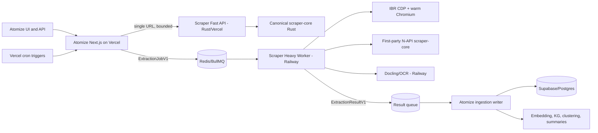

<!-- checklist
Item 1 — Auth guard: service-to-service HMAC or platform OIDC at every non-health scraper endpoint; existing Atomize user auth remains at product routes
Item 2 — External APIs: current official Vercel and Railway contracts are cited in Research Context and the research packet
Item 3 — Rate-limit criterion: one absolute deadline plus request-byte, redirect, per-host, global, queue, and browser concurrency ceilings
Item 4 — Discoverability: N/A: backend architecture only; no user-facing navigation changes
Item 5 — Server/client boundary: generated TypeScript/Zod contract and server-only service clients; browser clients never call extraction workers
Item 6 — Concurrency: BullMQ at-least-once delivery, deterministic job IDs, article/content-hash idempotency, and one persistence writer
Item 7 — Observability: structured per-stage events, trace/job IDs, queue age, runtime, quality, escalation, and cost dimensions
Item 8 — Input validation: Rust serde validation and Atomize Zod validation at every network and queue boundary
Item 9 — Stable ID traceability: U-01 -> F-01 -> D-01 -> T-01 is carried through the JSON spec object and acceptance table
Item 10 — JSON spec object: included before architecture rendering with needs, features, data points, tests, and ADRs
Item 11 — Blocking-and-novel question gate: no blocking design questions; deployment unknowns are explicit assumptions with Milestone 0 falsifiers
Item 12 — Low-reversibility ADRs: ADR-01 through ADR-07 cover ownership, hosting, queue, language, binding, and cutover decisions
Item 13 — Analytical lens: DSM for dependencies, Pugh selection for placement, and backcasting for migration
Item 14 — Handoff document: docs/plans/2026-07-12-rust-hybrid-scraper-architecture.handoff.md
Item 15 — Synthesis dimensions: N/A: no UI in scope
Item 16 — Risk reason: deployment; public contracts, multi-cloud routing, and runtime placement make this an architecture-risk plan
Item 17 — UI input/output contract: N/A: no UI in scope
Item 18 — Dispatch tier per work item: M0 sonnet; M1-M2 opus; M3-M4 sonnet; M5-M6 opus; M7 sonnet
Item 19 — Env-var manifest: names and owners are listed in Environment Contract; values remain in platform secret stores
Item 20 — Capability gap map: current owner, target owner, gap, build action, and validation are mapped for ten capabilities
Item 21 — Single-shot build guardrails: guardrails table states what each control prevents and the required evidence
Item 22 — Read-before-edit map: contract, core, network, Vercel, queue, browser, and OCR work list exact source surfaces to inspect first
-->

# Rust Hybrid Scraper Architecture

## Executive Decision

Build `blog-content-scraper` into the canonical extraction platform, with one
versioned Rust core and environment-specific adapters:

- Vercel runs the stateless fast path: fetch, feed/sitemap discovery, HTML
  extraction, metadata, Markdown, quality, and escalation classification.
- Railway runs stateful/native escalation: Chromium through IBR/CDP and
  PDF/image extraction through Docling/OCR.
- Atomize remains the product and data owner: source scheduling, BullMQ job
  production, result persistence, downstream enrichment, and user-facing APIs.
- Redis/BullMQ remains the durable cross-cloud control plane during migration.
- Mozilla Readability remains the rollback oracle until Rust passes corpus-level
  non-inferiority and production shadow gates.

This is a capability split, not a platform split. Vercel does bounded work that
can finish independently. Railway does work that benefits from warm processes,
native binaries, large models, or retries unconstrained by one HTTP invocation.

## North Star

For any supported URL, return the fullest defensible content with provenance,
within the cheapest runtime that can meet the accuracy requirement, without
letting a hard source delay unrelated ingestion.

Priority order: accuracy, speed, operational simplicity, code size, cost.

## Scope

### In scope

- Blog/news article discovery and extraction.
- RSS, Atom, JSON Feed, robots, XML sitemap, and HTML link discovery.
- Static HTML, client-rendered HTML, PDF, and image/OCR ingestion.
- A versioned extraction contract shared by Rust, Node, and Atomize.
- Vercel and Railway service boundaries, deployment manifests, and telemetry.
- A staged migration from current Atomize code without a one-release replacement.

### Out of scope

- Defeating paywalls, CAPTCHAs, or explicit access controls.
- Replacing Docling or production OCR models with Rust before accuracy parity.
- Replacing IBR's CDP engine with Rust while Chrome remains the dominant cost.
- Replacing Redis/BullMQ during the extraction-engine migration.
- Changing Atomize search, clustering, KG, embeddings, or summarization logic.

## Spec Object (JSON)

```json
{
  "needs": [
    {"id": "U-01", "priority": "P0", "text": "Extract complete article content accurately without Vercel batch timeouts"},
    {"id": "U-02", "priority": "P0", "text": "Use one canonical engine across Vercel and Railway"},
    {"id": "U-03", "priority": "P0", "text": "Escalate JavaScript, PDF, and OCR work without penalizing ordinary HTML"},
    {"id": "U-04", "priority": "P1", "text": "Keep deployment and operating cost proportional to heavy-path volume"}
  ],
  "features": [
    {"id": "F-01", "needIds": ["U-01", "U-02"], "text": "Pure Rust extraction and discovery workspace"},
    {"id": "F-02", "needIds": ["U-01"], "text": "Bounded Vercel Rust API"},
    {"id": "F-03", "needIds": ["U-03"], "text": "Railway IBR/CDP browser worker using the Rust core"},
    {"id": "F-04", "needIds": ["U-03"], "text": "Railway Docling/OCR adapter"},
    {"id": "F-05", "needIds": ["U-01", "U-04"], "text": "Capability-aware routing, caching, deadlines, and queue backpressure"},
    {"id": "F-06", "needIds": ["U-02"], "text": "Versioned request/result contract and Atomize adapter"}
  ],
  "dataPoints": [
    {"id": "D-01", "featureIds": ["F-01", "F-06"], "text": "ExtractedContentV1 schema"},
    {"id": "D-02", "featureIds": ["F-05"], "text": "SourceCapabilityV1 strategy and failure profile"},
    {"id": "D-03", "featureIds": ["F-03", "F-04"], "text": "ExtractionJobV1 and ExtractionResultV1 queue messages"},
    {"id": "D-04", "featureIds": ["F-05"], "text": "Per-stage timing, bytes, quality, and escalation reason telemetry"}
  ],
  "tests": [
    {"id": "T-01", "needIds": ["U-01"], "text": "Rust is non-inferior to production Readability on every critical corpus"},
    {"id": "T-02", "needIds": ["U-01"], "text": "Vercel cron completes as a bounded producer without extraction timeouts"},
    {"id": "T-03", "needIds": ["U-02"], "text": "Native Rust and Node binding return contract-equivalent output"},
    {"id": "T-04", "needIds": ["U-03"], "text": "Rendered HTML and OCR fixtures pass quality and provenance gates"},
    {"id": "T-05", "needIds": ["U-04"], "text": "Heavy-path concurrency stays within declared memory and queue limits"},
    {"id": "T-06", "needIds": ["U-01", "U-03"], "text": "SSRF, redirect, subresource, size, and decompression controls reject hostile fixtures"},
    {"id": "T-07", "needIds": ["U-01", "U-02"], "text": "Duplicate queue deliveries produce one effective article write and a durable failure audit"},
    {"id": "T-08", "needIds": ["U-01"], "text": "Feature flag restores the legacy extractor without schema rollback or data transformation"},
    {"id": "T-09", "needIds": ["U-01"], "text": "Single-article extraction returns that URL or an explicit failure and all counters satisfy attempted >= successful + failed"}
  ],
  "adrs": [
    {"id": "ADR-01", "text": "Canonical Rust core in blog-content-scraper"},
    {"id": "ADR-02", "text": "Separate Vercel Rust project before Vercel Services adoption"},
    {"id": "ADR-03", "text": "BullMQ remains the control plane"},
    {"id": "ADR-04", "text": "IBR/CDP stays Node and Railway-only"},
    {"id": "ADR-05", "text": "Docling stays Python and Railway-only"},
    {"id": "ADR-06", "text": "First-party N-API binding instead of third-party prebuild wrapper"},
    {"id": "ADR-07", "text": "No removal of Readability until shadow non-inferiority passes"}
  ]
}
```

## Current State: Here

| Area | Current implementation | Evidence | Consequence |
|---|---|---|---|
| Published scraper | TypeScript/Next package with Readability, Cheerio, JSDOM, RSS parser, Turndown, and Playwright | [VERIFIED] `blog-content-scraper/package.json` | Large Vercel graph and duplicated production logic |
| Public demo API | `/api/scraper-test` always calls source orchestration, even for an article URL; direct `extractArticle`/`smartScrape` returns the requested 881-word control correctly | [VERIFIED live/local] The route returned an unrelated changelog URL; `attempted: 1`, `successful: 1331` | Primary defect is route/mode wiring and stats semantics, not inability to extract the control article |
| Internal duplication | Root `lib/` and `packages/sdk/src/` carry diverging orchestrator implementations | [VERIFIED] source comparison | Fixes and telemetry semantics drift between public surfaces |
| Atomize extraction | Separate canonical TS ladder: JSON-LD, Readability, Cheerio, browser, Docling, LLM | [VERIFIED] `atomize-ai/lib/ingestion/extraction/extract.ts` | Atomize is ahead of its nominal scraper package |
| Vercel backfill | Up to 50 extracts inside one 270-second cron budget | [VERIFIED] `app/api/cron/content-backfill/route.ts` | Recent production 300-second timeouts |
| RSS cron | Bounded to nine sources but still performs network orchestration in the request | [VERIFIED] `app/api/cron/refresh-rss/route.ts` | Timeout and source-failure coupling remains |
| Queue | BullMQ `content-extraction` already connects Vercel ingestion to Railway | [VERIFIED] queue and worker source | Reusable durable boundary exists |
| Browser | Playwright-core + Chromium, gated to Railway, waits for DOM stability | [VERIFIED] `tiers/browser.ts` | Correct placement, replaceable controller |
| Railway image | Shared Node image installs Chromium and dispatches by service name | [VERIFIED] `Dockerfile`, `nixpacks.toml`, dispatcher | Every role can inherit browser build weight |
| Documents | Python Docling service and Node client exist; README says deploy held | [VERIFIED local, UNVERIFIED live] | OCR capability may not be active in production |
| Source learning | Outcomes are written but not read by the extraction router | [VERIFIED] source grep | Repeated known failures still pay probe cost |
| Production state | Vercel is READY on `origin/main`; local Atomize is 23 commits ahead | [VERIFIED live/local] | Migration must begin after branch reconciliation |
| Timing evidence | Root orchestrator now records elapsed time, but the duplicated SDK orchestrator still uses a collapsing elapsed-time formula | [VERIFIED] `lib/source-orchestrator.ts`, `packages/sdk/src/orchestrator/source-orchestrator.ts` | Existing cross-surface latency claims are not a trustworthy baseline |
| Accuracy gate | Quick F1 runner does not enforce the documented threshold, threshold rules disagree, and `tests/dragnet_data/` is absent | [VERIFIED] test runner, validators, tracked-file scan | Published F1 evidence cannot gate a Rust cutover yet |
| Candidate quality | Sitemap/HTML discovery can synthesize current dates; the package lacks Atomize's stronger junk/candidate gate | [VERIFIED] orchestrator and Atomize filter/selector source | False recency and false-positive candidates can inflate quality |
| Rust | No Cargo workspace or production Rust function | [VERIFIED] tracked-file scan | Rust migration has not started |

## Target State: There



### Runtime rule

1. Known static source or interactive single URL: call Rust fast path.
2. Scheduled/bulk work: enqueue immediately; never loop through article
   extraction inside a Vercel cron.
3. Worker tries native Rust HTTP extraction first unless source capability says
   browser/document/wall.
4. Low confidence or JavaScript shell: render with IBR/CDP, then run the same
   Rust `extract_html` core.
5. PDF/image: call Docling, normalize into the same result contract.
6. Persist once through Atomize's writer, then fan out downstream work.

## Service Placement

### Placement decision matrix

Scores are 1 (weak) to 5 (strong). The weighted total is a planning comparison,
not permission to trade away an acceptance gate: every promoted option must
still pass accuracy, latency, and resource ceilings independently.

| Option | Accuracy 35% | Latency 20% | Lightness 15% | Reliability 15% | Cost 10% | Migration 5% | Weighted |
|---|---:|---:|---:|---:|---:|---:|---:|
| All Vercel | 3 | 4 | 3 | 2 | 4 | 3 | 315/500 |
| All Railway | 5 | 3 | 2 | 4 | 2 | 3 | 360/500 |
| Hybrid fast/heavy split | 5 | 5 | 4 | 4 | 4 | 3 | **450/500** |

Why hybrid wins: ordinary pages keep burst scaling, low idle cost, and the Rust
fast path; difficult pages retain warm Chromium, native binaries, larger memory,
and model-loading freedom. All-Vercel couples accuracy to function/runtime
limits. All-Railway pays warm-service cost and queue/network latency for pages
that do not need heavy state.

### Vercel Edge: routing only

Do not run extraction on the Edge Runtime. Current Vercel guidance recommends
Node over Edge for performance/reliability; Edge exposes limited APIs and small
bundles and must begin a response within 25 seconds. Rust Runtime is a Fluid
Function runtime, not Edge. Use existing Edge/Routing Middleware only for cheap
auth, routing, feature-flag, or cached-status decisions when Atomize already
needs that placement.

### Vercel: `atomize-web`

Code remains in `/Users/tyroneross/dev/git-folder/atomize-ai`.

Owns:

- UI, authentication, user-facing API, and source configuration.
- Cron triggers and source-selection leases.
- At most a bounded source/feed fetch per request.
- Queue production and job-status endpoints.
- Result persistence adapter during the migration.
- Feature flags and shadow sampling.

Must not own:

- Multi-article extraction loops.
- Chromium or OCR binaries.
- Extraction algorithms duplicated from scraper-core.
- Long-running downstream enrichment in the request lifecycle.

### Vercel: `scraper-fast-rs`

Code lives in this repository under `apps/scraper-fast-vercel/` and imports the
workspace crates directly. Deploy it as a separate Vercel project initially.

Endpoints:

- `POST /v1/extract`: one URL or supplied HTML, strict deadline and byte cap.
- `POST /v1/discover`: one source, bounded candidate count.
- `GET /v1/health`: build, contract, and engine versions only.

No synchronous batch endpoint in P0. Batch belongs on the queue.
`/v1/extract` never falls through to discovery. It returns the requested URL,
its validated redirect/canonical equivalent, or a typed failure. `/v1/discover`
is the only endpoint allowed to return different article URLs.

Reasons:

- Rust Runtime beta supports Fluid Compute and native observability.
- Isolation avoids JSDOM/Turbopack and Next.js dependency tracing.
- Separate deployment gives independent canary, rollback, and resource sizing.
- It avoids changing Atomize's project framework to Vercel Services during the
  engine migration.

Tradeoff: one internal/public HTTPS hop. Mitigate with keep-alive, regional
co-location, HMAC/OIDC service auth, and an optional Vercel Service Binding only
after a preview proves current Rust/Services compatibility.

### Railway: `scraper-heavy`

Code lives here under `apps/scraper-heavy-worker/`.

Runtime image contains:

- Node 24.
- `@tyroneross/interface-built-right` CDP engine.
- Chromium.
- First-party Linux N-API build of `scraper-core`.
- BullMQ client and contract package.

Owns:

- `ExtractionJobV1` consumption.
- Direct HTTP extraction through the native binding.
- Browser escalation with a warm browser/context pool.
- All-request CDP network policy, including subresources and redirects.
- Docparse delegation.
- `ExtractionResultV1` publication.

Default worker sizing:

- Extraction jobs: concurrency 5.
- Browser contexts: concurrency 2 until memory testing raises it.
- Per-host concurrency: 1 by default, adaptive only from explicit source policy.
- Browser recycle: bounded by page count and resident memory.

Run warm when speed matters. Railway serverless sleep is an optional low-volume
cost mode, not the production default for latency-sensitive browser recovery.

### Railway: `docparse`

Move the generic service from Atomize into this repository under
`apps/docparse-service/` after its current branch/deploy state is reconciled.

Keep Python/Docling because OCR/layout accuracy outranks language uniformity.
Expose only private Railway networking or authenticated service access. Preload
models when warm. Use serverless sleep only if the measured document arrival
rate justifies cold model starts.

### Document/OCR component decision

Use Docling as the document-structure pipeline and keep OCR behind its engine
interface. "IBM OCR" is not one monolithic recognition engine here:
`docling-ibm-models` supplies layout detection and TableFormer structure, while
Docling delegates text recognition to RapidOCR, Tesseract, EasyOCR, or another
configured backend.

P0 Railway CPU pipeline:

1. Validate magic bytes, type, bytes, pages, dimensions, and URL policy.
2. Parse native text first; do not OCR a good digital text layer.
3. If an image or PDF page has insufficient text density, run RapidOCR through
   ONNX Runtime. The current service already packages this lightweight backend.
4. Preserve Docling reading order, layout, table, page, and bounding-box evidence
   when normalizing to `ExtractedContentV1`.
5. Run Tesseract and EasyOCR as corpus competitors for language/scan segments;
   route only a measured winner, never a name-based default.

Required correction: current Atomize `ocr=auto` chooses OCR for images only; a
scanned PDF can complete the text-layer path with little or no text and never
retry OCR. Milestone 6 adds page/text-density fallback and mixed-PDF fixtures.

Do not adopt OmniParse as a service dependency in P0. Current source inspection
found a 2024-era broad Torch/Surya/Marker/Whisper/Selenium stack, an 8-10 GB GPU
expectation, GPL-3.0 repository licensing with conflicting `pyproject` metadata,
Marker model restrictions, duplicate router registration, wildcard CORS, no
service auth, and unbounded upload reads. It is neither lightweight nor a safer
operational base. It may enter the same held-out document evaluation only after
license review and resource/security hardening; upstream quality claims do not
count as evidence.

### Atomize: `ingestion-writer`

Initially this is the existing `scraper-worker` persistence code. In the target
state, it consumes `ExtractionResultV1` and owns all article writes. It can be
co-located with the existing BullMQ worker; it does not require a new paid
service unless queue isolation metrics justify one.

This keeps scraper code independent of the Atomize Prisma schema and gives one
idempotent write boundary.

## Repository Scaffold

```text
blog-content-scraper/
  Cargo.toml
  crates/
    scraper-contract/        # serde/schemars types, versions, enums
    scraper-core/            # pure HTML -> candidates -> scored result
    scraper-net/             # SSRF-safe fetch, redirects, limits, robots
    scraper-discovery/       # RSS/Atom/JSON Feed/sitemap/HTML links
    scraper-eval/            # corpora, scorers, benchmark runner
  bindings/
    scraper-node/            # first-party napi-rs adapter
  packages/
    contracts-ts/            # generated TS types + Zod runtime schemas
    client-ts/               # server-only Vercel/queue client
  apps/
    scraper-fast-vercel/     # Rust Vercel handlers
    scraper-heavy-worker/    # Node + IBR/CDP + native binding
    docparse-service/        # Python Docling/OCR
    web/                     # existing test/demo UI, optional
  evals/
    bundled/
    dragnet/
    wcxb/
    atomize-regressions/
  docs/
    plans/
    contracts/
    operations/
```

Atomize consumes only `contracts-ts`, `client-ts`, and queue messages. It does
not import parser internals.

## Rust Dependency Strategy

P0 dependencies:

- `tokio`, `reqwest` with rustls, `url`, `serde`, `serde_json`, `chrono`.
- `feed-rs` (current 2.4 line) for one RSS/Atom/JSON Feed model.
- `quick-xml` for streaming sitemap parsing.
- A `RobotsPolicy` adapter with `robotxt` as the feature-complete candidate and
  Google's native-Rust `robotstxt` port as the matching oracle; choose only
  after RFC 9309, sitemap, crawl-delay, Common Crawl, and fuzz conformance tests.
- `schemars` for JSON Schema generation.
- `sha2` for compatibility with current content hashes.
- `tracing` and OpenTelemetry-compatible export.
- `napi-rs` for the Railway/Node binding.
- `vercel_runtime` only in the Vercel adapter crate.

Extractor candidate:

- Pin `rs-trafilatura` to a reviewed revision behind `Extractor` trait.
- Do not trust its README benchmarks as acceptance evidence.
- Keep a first-party metadata/quality reconciliation layer so output is stable
  if the underlying extractor changes.
- If corpus non-inferiority fails, port the minimum validated Readability logic
  or run Readability as the production fallback. Rust is not the acceptance
  criterion; extraction quality is.

Do not use the separate `napi-rs-trafilatura` package. Its thin wrapper builds,
but a first-party binding gives deterministic Linux artifacts and contract
mapping without depending on third-party optional-package publication.

## Contract

### `ExtractionRequestV1`

```json
{
  "schemaVersion": "1.0",
  "requestId": "uuid",
  "url": "https://example.com/article",
  "html": null,
  "deadlineMs": 10000,
  "maxBytes": 10485760,
  "respectRobots": true,
  "requestedOutputs": ["text", "markdown", "metadata"]
}
```

### `ExtractedContentV1`

Required fields:

- `schemaVersion`, `engineVersion`, `requestId`.
- `url`, `canonicalUrl`, `title`, `text`, `markdown`.
- `tier`, `method`, `quality`, `confidence`, `wordCount`, `contentHash`.
- `metadata` including author, publication time, site, language, and image.
- `evidence` naming selected DOM/structured-data sources without raw secrets.
- `timings` by DNS, connect, download, parse, score, render, and OCR.
- `warnings` and a closed `failureClass`/`escalationReason` enum.

Dates cross the wire as ISO-8601 strings. TypeScript converts them only at the
application edge. Raw HTML is excluded by default and enabled only for bounded
debug/admin use.

### Escalation classes

- `none`
- `javascript_shell`
- `low_confidence`
- `blocked_403`
- `rate_limited`
- `pdf`
- `image`
- `paywall`
- `unreachable`
- `invalid_source`
- `deadline_exceeded`

`paywall`, explicit denial, and repeated true walls are terminal. The system
must not label them browser-recoverable without a successful observed result.

## Routing and Caching

### Capability-aware router

Source profile fields:

- `preferredStrategy`: static, browser, document, terminal.
- `lastSuccessTier`, `lastFailureClass`, `successRate`.
- `p50Ms`, `p95Ms`, `lastCheckedAt`, `expiresAt`.
- `consecutiveFailures`, `retryAfter`, `policyVersion`.

Routing uses the profile only as a hint. A stale profile expires and re-probes.
A browser classification requires a prior successful browser extraction, not
merely a static failure.

### Cache hierarchy

1. HTTP validators: ETag and Last-Modified.
2. Redis shared result cache keyed by canonical URL, validator/content hash,
   requested outputs, and engine version.
3. Optional Vercel Runtime Cache as regional L1 only.
4. Short negative cache for terminal 404/paywall/invalid-source outcomes.

Cache never overrides robots policy, auth policy, or a caller's explicit
freshness requirement.

## Deadlines and Backpressure

- One absolute request deadline propagates through DNS, redirects, body read,
  parse, scoring, browser rendering, OCR, and persistence.
- Aborting the deadline cancels underlying work; it does not merely reject the
  caller while work continues.
- Fast API default: 10 seconds, one URL, 10 MB compressed response body, bounded
  decompressed size and DOM node count.
- Discovery default: 8 seconds, 100 candidates, 5 sitemap documents.
- Browser default: 25 seconds end to end with DOM-stability wait.
- Docparse default: 120 seconds with a configurable document/page/byte cap.
- Retries only for idempotent transport failures, 429 with Retry-After, and
  selected 5xx responses. Never retry ordinary 4xx, paywalls, or parse-empty
  outcomes blindly.
- Queue attempts use exponential backoff plus jitter and a terminal failed-job
  record; poison jobs must not block newer work.

## Threat Model

Threat-model artifact: this section. Primary web risk: OWASP Server-Side Request
Forgery. Agentic-risk classification is not applicable because no LLM is given
tool autonomy in the P0 scraper path.

Controls:

- Resolve and reject private, loopback, link-local, metadata, multicast, and
  reserved IP ranges before every request.
- Re-resolve and validate every redirect.
- In Chromium, validate every network request, including XHR, scripts,
  stylesheets, frames, WebSockets, and top-level navigation.
- Prevent DNS rebinding by binding the validated resolution to the connection or
  revalidating at connect time.
- Cap redirects, headers, compressed bytes, decompressed bytes, DOM nodes,
  document pages, OCR pixels, and output bytes.
- Never provide browser pages with application cookies, cloud credentials,
  internal service URLs, or database credentials.
- Run browser contexts isolated; clear storage and service workers between jobs.
- Authenticate service calls and queue producers; authorize result persistence.
- Validate queue schemas and idempotency keys before side effects.
- Respect robots policy by default and record the policy decision.
- Do not implement paywall or CAPTCHA bypass.

## Observability

Emit one trace spanning producer -> queue -> fetch/render/OCR -> extraction ->
writer. Required events:

- `scrape.request.accepted`: request ID, source host, mode, deadline.
- `scrape.fetch.completed`: status, redirects, bytes, validator, latency.
- `scrape.extract.candidate`: tier, quality, word count, failure class.
- `scrape.extract.selected`: engine version, tier, quality, content hash.
- `scrape.escalated`: reason, source capability, target service.
- `scrape.browser.completed`: navigation, stability, blocked request counts.
- `scrape.docparse.completed`: format, pages, OCR used, latency.
- `scrape.persist.completed`: article ID, idempotent/no-op/written, latency.
- `scrape.job.failed`: stage, attempt, retry class, terminal flag.

Never log article text, credentials, signed service URLs, or full query strings.

Dashboards:

- Success and quality by source and tier.
- Fast/browser/document distribution.
- p50/p95/p99 end-to-end and stage latency.
- Timeout, 403, 429, invalid source, and terminal wall counts.
- Queue age, active jobs, retries, failed jobs, and worker memory.
- Cost proxy: active CPU, provisioned memory, Chrome minutes, OCR pages.

## Acceptance Criteria

| ID | Criterion | Pass condition |
|---|---|---|
| T-01 | Extraction accuracy | Rust is no worse than production Readability by more than 0.5 F1 points on each critical corpus; no critical-source regression is accepted without an explicit adjudication |
| T-01a | Metadata accuracy | Title/author/date/canonical exact-match or normalized-match is non-inferior on held-out fixtures |
| T-01b | Completeness | No promoted output loses more than 5% of reference article tokens unless the removed tokens are labeled boilerplate |
| T-02 | Vercel cron | Cron performs scheduling/enqueue only, returns under 15 seconds p95, and records zero extraction-related runtime timeouts for seven days |
| T-03 | Contract parity | Native Rust, N-API, and HTTP adapters pass the same golden contract fixtures byte-for-byte after timestamp normalization |
| T-04 | Browser recovery | Every browser-promoted source proves a static failure and successful rendered extraction above quality threshold |
| T-04a | OCR | PDF/image output meets the existing Docling fixture and visual-layout assertions; no OCR engine substitution without quality evidence |
| T-05 | Fast performance | Parse-only p95 <= 50 ms for HTML <= 2 MB on the reference runner; end-to-end static p95 <= 2 seconds excluding source-controlled slow responses |
| T-05a | Resource ceiling | Vercel fast path remains within 2 GB; browser worker survives declared concurrency without OOM or queue starvation |
| T-06 | Security | Hostile SSRF, redirect, DNS-rebinding, decompression, oversized-document, and Chromium-subresource fixtures are rejected before protected access |
| T-07 | Reliability | At-least-once duplicate jobs produce one effective article write and preserve a failed-job audit record |
| T-08 | Rollback | Feature flag returns Atomize to the current TS/Readability path without schema rollback or data transformation |
| T-09 | Result identity and stats | `/v1/extract` returns the requested/redirect-equivalent document or a typed failure; every response satisfies `attempted >= successful + failed` and successful never exceeds attempted |

## Approach Lenses

Analytical lens: DSM for component dependencies, Pugh selection for platform and
queue options, and backcasting for migration.

### Clean-sheet best approach

One extraction monorepo owns contracts, Rust core, Vercel API, Railway browser,
Railway document parsing, and evals. Atomize sends versioned requests and
persists versioned results. No parser code lives in Atomize.

### Current-constraints approach

Keep Atomize's existing queue, worker, writer, browser tier, and Docling client.
Introduce the Rust core first through shadow adapters, then move generic service
code after parity. This avoids combining queue, persistence, engine, and
deployment changes in one release.

### Bridge/backcast

1. Freeze contract and corpus.
2. Build and benchmark pure Rust core with no production routing.
3. Add N-API and Vercel adapters in shadow mode.
4. Flip single-URL fast extraction behind a flag.
5. Turn Vercel batch crons into queue producers.
6. Replace Railway Playwright controller with IBR/CDP while retaining output.
7. Move generic browser/docparse services into the scraper repo.
8. Delete duplicate Atomize extraction only after rollback window closes.

### Recommendation

Execute the constrained bridge. The clean-sheet target is correct, but the
current 23-commit local/production gap, unauthenticated Railway state, and beta
Vercel Rust/Services surfaces make a flag-day move unjustified.

## ADRs

### ADR-01: Rust core is canonical

Decision: Pure extraction, quality scoring, metadata normalization, discovery,
and network policy live in this repository.

Alternatives: keep Atomize TypeScript canonical; fork logic in both repos.

Tradeoff: Rust expertise and build tooling are required. Benefit: one fast,
memory-efficient engine and no JSDOM production dependency.

Rollback: Atomize retains the current extractor behind `SCRAPER_ENGINE=legacy`
until shadow acceptance and a defined rollback window pass.

### ADR-02: Separate Vercel project first

Decision: Deploy `scraper-fast-rs` separately from Atomize's Next project.

Alternatives: N-API inside Next; change Atomize to Vercel Services immediately.

Tradeoff: an HTTPS hop and service auth versus stronger isolation and rollback.

Rollback: route the Atomize client back to its in-process legacy adapter.

### ADR-03: Keep BullMQ/Redis

Decision: Reuse the current cross-cloud queue.

Alternatives: Vercel Queues poll mode or Vercel Workflow.

Tradeoff: continue operating Redis. Avoid a beta dependency, missing native
DLQ, a second queue system, and a queue migration during engine replacement.
Current Vercel Queue retention of up to seven days is sufficient for many jobs
and is not itself a rejection reason.

Revisit: Vercel Queues GA, an accepted poison-message/DLQ policy, and a measured
lower failure and operating burden than BullMQ.

### ADR-04: Browser stays Node/IBR on Railway

Decision: Replace Playwright control with IBR's custom CDP engine, not a Rust
browser replacement.

Alternatives: Chromium in Vercel; Rust CDP library; keep Playwright.

Tradeoff: a mixed Node/Rust worker. Benefit: reuse validated DOM-stability and
browser lifecycle code while Chrome remains the dominant resource.

Rollback: worker flag selects the current Playwright browser tier.

### ADR-05: Docling stays Python

Decision: Preserve the current Docling/OCR service.

Alternatives: Rust PDF text libraries plus a new OCR engine; Omniparse.

Tradeoff: mixed-language stack and a larger Railway image. Benefit: preserves
layout/OCR capability and avoids an unmeasured accuracy sacrifice.

Rollback: disable document escalation without affecting HTML extraction.

### ADR-06: First-party N-API binding

Decision: Build `bindings/scraper-node` with napi-rs.

Alternatives: third-party `napi-rs-trafilatura`; subprocess CLI; WASM.

Tradeoff: cross-platform release work. Benefit: deterministic artifacts,
contract mapping, lower call overhead, and project-controlled provenance.

Rollback: Node worker calls Rust fast API or legacy TS extractor.

### ADR-07: Readability is the migration oracle

Decision: Rust must beat or match the current production baseline before flip.

Alternatives: replace based on speed or upstream README benchmarks.

Tradeoff: dual-run shadow cost during migration. Benefit: accuracy is protected.

Rollback: immediate feature-flag selection of Readability.

## Core Assumptions

| Assumption | Basis | Falsifier | Response |
|---|---|---|---|
| At least 80% of supported pages remain static-fetchable | Historical 57-source probe and current architecture | Browser/document share exceeds 30% for 14 days | Re-evaluate worker capacity and fast-path placement |
| Rust can meet Readability quality | `rs-trafilatura` candidate plus existing algorithms | T-01 fails after bounded tuning | Keep Readability or port validated missing logic |
| Existing BullMQ is sufficiently durable | Current production producer/consumer code | Lost/stuck jobs or queue SLO miss | Run Vercel Queue poll-mode bakeoff after GA |
| One warm browser worker is enough initially | Heavy path expected minority | Queue age p95 > 60 seconds or CPU/memory saturation | Add replicas or source-based partitions |
| Docling remains best known local document parser | Existing implemented service and prior research | Omniparse/other engine wins held-out quality and resource gates | Replace behind `DocumentParser` interface |
| Vercel Rust beta is acceptable behind a fallback | Official beta support plus reversible adapter | Error/cold-start regression above threshold | Keep Rust on Railway and use Node/N-API on Vercel temporarily |
| Production can be reconciled before migration | Local is 23 commits ahead of deployed origin | Release blocker cannot close safely | Build in isolated branch but do not route production |

## Tradeoffs Made

1. Mixed languages over purity: Rust for deterministic extraction, Node for IBR,
   Python for Docling. This preserves accuracy and reuses working engines.
2. Two compute platforms over one: Vercel for bursty fast work, Railway for warm
   stateful/native work. This minimizes normal latency without forcing Chrome
   into every invocation.
3. Existing queue over newest platform feature: BullMQ avoids simultaneous
   infrastructure migration and supports current workers.
4. Network API over in-process Atomize parser: adds a small hop but isolates
   dependencies, versions the engine, and enables independent rollout.
5. Shadow cost over risky replacement: dual extraction is temporary and sampled;
   it buys measurable accuracy protection.
6. Separate worker images over one dispatcher image: slightly more deployment
   configuration, substantially smaller blast radius and idle footprint.

## Capability Gap Map

| Capability | Current source | Target | Gap | Build action | Validation |
|---|---|---|---|---|---|
| Canonical extraction | Atomize TS plus scraper package | `scraper-core` Rust | Duplicate owners | Contract-first Rust core and adapters | T-01, T-03 |
| Feed/sitemap discovery | TS orchestrators | Rust bounded discovery | Sequential/repeated probes | Shared deadline and raced candidates | Discovery corpus and p95 |
| Vercel scheduled work | Synchronous extraction batches | Producer only | Runtime timeouts | Enqueue and return bounded stats | T-02 |
| Source learning | Writes capability only | Reads and routes | Dormant feedback loop | TTL profile router | Routing integration tests |
| Browser control | Playwright-core | IBR CDP | Heavy dependency and generic image | Dedicated worker/image | T-04, memory load test |
| Browser network safety | Main navigation checks | Every request checked | Subresource SSRF exposure | CDP request policy | T-06 |
| Document parsing | Held Docling service | Active private service | Live state unknown | Verify/deploy after contract gate | T-04a |
| Persistence boundary | Worker extracts and writes | Versioned result -> writer | Scraper knows Atomize schema | Result queue adapter | T-07 |
| Cross-runtime types | Handwritten TS | JSON Schema generated TS/Zod | Drift risk | `schemars` generation check | CI diff gate |
| Evaluation | TS DOE branch | Cross-engine corpus runner | Rust untested locally | Add Rust/Readability/production comparators | T-01 suite |

## From Here to There

### Dispatch Map

| Milestone | Dispatch tier | Risk boundary | Primary judgment |
|---|---|---|---|
| M0 | `dispatch_tier: sonnet` | deployment | Reconcile deployed state and establish evidence |
| M1 | `dispatch_tier: opus` | runtime protocol | Freeze a cross-language public contract and accuracy baseline |
| M2 | `dispatch_tier: opus` | security boundary | Bound network concurrency, cancellation, and hostile inputs |
| M3 | `dispatch_tier: sonnet` | deployment | Introduce reversible Vercel shadow traffic |
| M4 | `dispatch_tier: sonnet` | persistence contract | Change cron work into idempotent queue production |
| M5 | `dispatch_tier: opus` | deployment | Combine Rust parsing with IBR/CDP browser isolation |
| M6 | `dispatch_tier: opus` | deployment | Activate measured Docling/OCR escalation |
| M7 | `dispatch_tier: sonnet` | deployment | Cut over only after production non-inferiority gates |

### Milestone 0: Reconcile and baseline

Goal: establish a deployable baseline before introducing Rust.

Actions:

1. Reconcile Atomize local `main` (23 commits ahead) with production and complete
   the existing release gates.
2. Restore Railway read access and capture service names, deploy revisions,
   memory/CPU, queue age, and current Docling state.
3. Contain the current public wrong-document failure before Rust: give the demo
   route an explicit article/listing mode, route article requests through the
   direct extractor, and return a typed failure instead of silently substituting
   feed/sitemap content.
4. Repair and lock measurement semantics before benchmarking: one elapsed-time
   implementation across root/SDK orchestrators, separate discovery/extraction
   counters, retry-state reset, and tests with a controlled non-zero delay.
5. Replace the non-enforcing quick F1 command with one executable acceptance
   gate; restore a license/provenance-safe corpus and version its references.
6. Export the current extraction contract and production source corpus.
7. Materialize DOE datasets from `codex/scraper-doe` into a versioned eval
   package without changing production routing.
8. Add candidate and metadata holdouts for synthetic dates, cross-host links,
   navigation/legal/feed pages, ambiguous slugs, and JSON-LD precedence.
9. Add the live wrong-document regression: article-shaped input must never return
   an unrelated feed/sitemap candidate, and statistics must satisfy invariants.
10. Record seven days of tier, quality, valid latency, timeout, and source-failure
   data.

Exit gate: current TS path is deployable, reproducible, and benchmarked; the
acceptance command fails on a below-threshold fixture, and elapsed-time tests
prove both public orchestrators report real duration.

### Milestone 1: Contract and Rust walking skeleton

Goal: prove one URL -> one canonical result locally.

Actions:

1. Add Cargo workspace and `scraper-contract`.
2. Generate TypeScript/Zod types and fail CI on drift.
3. Implement `scraper-core::extract_html` behind an `Extractor` trait.
4. Integrate pinned `rs-trafilatura` candidate plus first-party reconciliation.
5. Add the N-API adapter and local CLI only for verification.
6. Run all golden fixtures through Rust and current Readability.

Exit gate: T-01 and T-03 pass locally. No production routing.

### Milestone 2: Network and discovery

Goal: make the Rust service safe and bounded.

Actions:

1. Add SSRF-safe resolver/fetcher with redirect and body limits.
2. Add robots, feed, sitemap, and HTML discovery under one deadline.
3. Implement per-host limiter with real overlapping global concurrency.
4. Add validators, content hash, capability profile, and Redis cache adapter.
5. Add hostile fixtures and cancellation tests.

Exit gate: T-05 and T-06 pass; cancellation stops underlying work.

### Milestone 3: Vercel shadow service

Goal: validate Rust Runtime and network placement without user-visible change.

Actions:

1. Deploy `scraper-fast-rs` preview as a separate Vercel project.
2. Add HMAC/OIDC service auth, rate limits, and observability.
3. Prove `/v1/extract` identity and counter invariants against the live regression
   set before shadow traffic.
4. Shadow 5% of eligible Atomize extracts; do not persist Rust results.
5. Compare text, metadata, quality, latency, errors, and cost proxies.
6. Raise sampling to 25% only after no critical regression for seven days.

Exit gate: T-01, T-03, and T-05 pass in production shadow; rollback tested.

### Milestone 4: Remove Vercel batch work

Goal: eliminate the observed serverless timeout class.

Actions:

1. Change content backfill to claim rows, enqueue `ExtractionJobV1`, and return.
2. Keep RSS refresh bounded to source discovery and article insertion; enqueue
   extraction/enrichment separately.
3. Make jobs idempotent by article ID, URL normalization, engine version, and
   content hash.
4. Add queue-age and producer-completion SLOs.

Exit gate: T-02 passes for seven days and the per-run reconciliation assertion
`claimed = queued + terminal_failures` passes in production telemetry.

### Milestone 5: Railway heavy path

Goal: make browser escalation lighter and share the Rust core.

Actions:

1. Create dedicated multi-stage browser worker image.
2. Replace Playwright control with IBR CDP behind a reversible flag.
3. Load first-party Linux N-API core and parse rendered HTML locally.
4. Enforce SSRF policy on every CDP network request.
5. Add browser pool, recycle limits, health endpoint, deploy draining, and
   memory/concurrency load tests.
6. Publish `ExtractionResultV1` to the result queue.

Exit gate: T-04 through T-07 pass and browser memory is stable for a 24-hour soak.

### Milestone 6: Documents and OCR

Goal: activate document extraction without coupling it to HTML traffic.

Actions:

1. Verify the existing Docling service branch, image, tests, and deployment.
2. Move generic service ownership into this scraper repository.
3. Put it on private Railway networking with auth and byte/page/time limits.
4. Run PDF text-layer, scanned PDF, image, table, and malformed-document holdouts.
5. Fix `auto` mode to retry OCR for scanned or low-text PDF pages and record
   per-page OCR provenance.
6. Compare RapidOCR, Tesseract, and EasyOCR through the same eval contract;
   compare OmniParse only after its license and service-hardening gates pass.

Exit gate: T-04a and T-06 pass; cold/warm policy chosen from measured volume.

### Milestone 7: Canonical cutover and cleanup

Goal: remove duplicate production engines only after evidence closes the risk.

Actions:

1. Promote Rust fast path to primary for eligible single requests.
2. Route all Atomize scheduled extraction through jobs.
3. Run a 14-day rollback window.
4. Remove JSDOM/Readability/Cheerio from Atomize production graph only after the
   rollback window; retain them in eval tooling if useful.
5. Remove Playwright from browser runtime only after IBR parity.
6. Remove the root/SDK TypeScript orchestrator duplication after every public
   entrypoint delegates to the versioned Rust core or client.
7. Archive obsolete plans and update operations documentation.

Exit gate: one canonical engine, no duplicated parser ownership, stable SLOs,
and tested rollback artifacts.

## Dependency Graph

```text
M0 baseline
  -> M1 contract/core
      -> M2 network/discovery
          -> M3 Vercel shadow
              -> M4 queue-only crons
      -> M5 Railway browser adapter
      -> M6 Docling integration
M3 + M4 + M5 + M6
  -> M7 canonical cutover
```

Parallelization:

- After M1 contract freeze, M2 network, M3 adapter scaffolding, M5 browser-image
  work, and M6 Docling verification have disjoint primary write sets.
- Production routing stays sequential behind acceptance gates.
- This turn authorized Build Loop planning, not Codex subagent delegation; the
  plan was self-performed locally.

## Single-Shot Build Guardrails

| Guardrail | What it prevents | Evidence |
|---|---|---|
| No flag-day replacement | Silent accuracy regression | T-01 shadow gate and ADR-07 |
| No batch extraction in Vercel cron | 300-second timeout recurrence | T-02 and route inspection |
| One generated contract | TS/Rust field drift | T-03 and CI schema diff |
| One absolute deadline | Rejected caller while work continues | cancellation integration test |
| Every browser request validated | Chromium subresource SSRF | T-06 hostile page |
| Browser and OCR isolated | All workers inherit heavy images | image-size and service manifest audit |
| Idempotent persistence | At-least-once duplicate writes | T-07 duplicate delivery test |
| No external benchmark trust | Upstream F1 becomes false confidence | local corpus report required |
| No paywall bypass | Legal/ethical and reliability risk | terminal-class tests |
| No beta queue migration | Compounded infrastructure change | ADR-03 |

## Read-Before-Edit Map

| Work item | Read first | Why | Edit after |
|---|---|---|---|
| Contract | Atomize `extracted-content.ts`, writer, queue types, scraper output types | Preserve current consumers and dates/hashes | `crates/scraper-contract`, generated TS package |
| Core | DOE report/harness, Atomize tiers/select helpers, `rs-trafilatura` source/tests | Reuse validated rules and establish baseline | `crates/scraper-core`, evals |
| Network | Both repos' fetchers, robots checker, SSRF guard, rate limiter | Preserve policy and fix cancellation/concurrency | `crates/scraper-net`, discovery |
| Vercel | Rust Runtime docs, current `vercel.json`, deployed function config | Avoid unsupported duration/service assumptions | `apps/scraper-fast-vercel` |
| Queue migration | RSS service, content queue, backfill cron, single writer | Preserve claim/idempotency semantics | Atomize producer/writer adapters |
| Browser | IBR browser/driver/network code, Atomize browser tier, Docker manifests | Preserve DOM stability and close request-policy gaps | heavy worker and Dockerfile |
| OCR | Docparse client/service/tests and held deployment plan | Avoid replacing an unverified service blindly | docparse app/adapter |

## Depends-on (reads-from)

- Atomize `ExtractedContent` semantics and single-writer invariants - verified.
- BullMQ/Redis producer and consumer configuration - verified in source; live
  Railway state unverified and resolved by Milestone 0.
- Source capability database columns - verified in Atomize source/schema.
- Vercel Rust Runtime beta behavior - verified from current official docs.
- Vercel 30-minute support for Rust - explicitly not assumed.
- Railway service names/resources - unverified live; blocking only for deploy,
  not for local core development, and resolved by Milestone 0.
- Docling service production state - unverified live; resolved by Milestone 0/6.

## Activation Map

- Vercel source cron - trigger: existing Vercel Cron schedules - verified-live: yes.
- Content extraction producer - trigger: RSS insert and backfill claim call sites - verified-live: pending; verified in Milestone 4 integration.
- Railway heavy consumer - trigger: BullMQ `content-extraction` queue - verified-live: pending; verified in Milestone 5 staging.
- Result writer - trigger: BullMQ `content-extraction-results` queue - verified-live: pending; verified in Milestone 5 staging.
- Docparse adapter - trigger: document/image escalation enum - verified-live: pending; verified in Milestone 6 staging.

## Environment Contract

Names only; values belong in platform secret stores.

Shared:

- `SCRAPER_CONTRACT_VERSION`
- `SCRAPER_ENGINE_VERSION`
- `SCRAPER_SERVICE_AUTH_KEY` or platform OIDC configuration
- `REDIS_URL`
- `OTEL_EXPORTER_OTLP_ENDPOINT`

Atomize:

- `SCRAPER_FAST_URL`
- `SCRAPER_ENGINE=legacy|shadow|rust`
- `SCRAPER_SHADOW_SAMPLE_RATE`

Railway heavy worker:

- `IBR_CDP_URL` or local Chrome path configuration
- `DOCPARSE_SERVICE_URL`
- `DOCPARSE_API_KEY`
- `CONTENT_EXTRACTION_CONCURRENCY`
- `BROWSER_CONTEXT_CONCURRENCY`

All external calls require explicit timeout, maximum response bytes, retry
classification, and rate-limit handling. No endpoint accepts an unlimited body.

## Cost Envelope

Current public list prices, not a forecast:

- Vercel: from $0.128 active CPU-hour, $0.0106/GB-hour memory, and
  $0.0000006/invocation after applicable included usage.
- Railway: $10/GB-month RAM, $20/vCPU-month CPU, $0.05/GB egress, with a $5
  Hobby minimum that counts toward resource usage.

Planning scenario at 100,000 pages/month and a 90/8/2 static/browser/document
mix:

- At 90,000 Vercel fast-path pages, 150 ms active CPU and two seconds at 2 GB
  produce about 3.75 CPU-hours, 100 GB-hours of memory, and 90,000 invocations.
  That is inside current Hobby allowances but leaves only 15 CPU-minutes of
  margin; shadow traffic, retries, and other project functions make Hobby an
  unsafe production budget assumption. At current `iad1`/`pdx1` rates, the same
  raw Pro usage is roughly $1.60 before plan credits and transfer.
- One warm 2 GB browser worker at 0.25 average vCPU is roughly $25/month before
  egress.
- Warm Docling is likely another $20-$50/month depending on memory and CPU;
  sleeping lowers idle cost but raises first-job latency and can return a 502 on
  the first wake request, so queue retry behavior must absorb it.
- Additional browser replicas scale approximately with warm memory plus actual
  CPU. Do not add replicas until queue age or utilization crosses its SLO.

## Research Context

Depth: standard/balanced. Current platform claims are blocked unless cited.

Packet:
`.build-loop/research/2026-07-12-plan-optimal-rust-hybrid-scraper-architecture-across-vercel.md`

Primary official sources:

- https://vercel.com/docs/functions/runtimes/rust
- https://vercel.com/docs/functions/runtimes/edge
- https://vercel.com/docs/functions/usage-and-pricing
- https://vercel.com/docs/queues
- https://vercel.com/docs/services
- https://vercel.com/docs/caching/runtime-cache
- https://docs.railway.com/deployments/serverless
- https://docs.railway.com/functions
- https://docs.railway.com/config-as-code/reference
- https://docs.railway.com/pricing/plans

Open-source source reviews:

- https://github.com/Murrough-Foley/rs-trafilatura
- https://github.com/gorango/napi-rs-trafilatura

## Plan Acceptance Readback

- Checklist: clean, 22/22 items answered with zero structural warnings.
- Deterministic verifier: zero blockers; four activation warnings remain for
  components that do not exist or cannot be checked live yet.
- Independent architect review: incorporated. It identified invalid SDK timing,
  non-enforcing/inconsistent F1 gates, weak candidate/metadata handling, root/SDK
  drift, and stale extraction flags; Milestone 0 and the corpus now cover them.
- Document parser review: incorporated. It identified the scanned-PDF `auto` OCR
  gap and rejected OmniParse as the P0 default after source/license/resource
  inspection.
- Scope auditor: pending at the Plan-to-Execute boundary because public contracts
  do not exist yet. Milestone 1 must enumerate all Atomize/package callers before
  freezing `ExtractedContentV1` or queue message signatures.

Gaps readback: no architecture blocker remains. Railway service inventory,
Docling live deployment, producer/consumer activation, and result-writer
activation are deliberately unverified and mapped to Milestones 0, 4, 5, and 6.

## Deployment Assumptions

No blocking design question remains for local Milestones 0-2.

Production-only facts to resolve before deployment:

- [ASSUMED: current BullMQ/Redis remains available across Vercel and Railway.]
- [ASSUMED: the Railway `scraper-worker` can be replaced or renamed without an
  external consumer depending on the service name.]
- [ASSUMED: current Vercel account permits a separate Rust preview project.]
- [ASSUMED: Docling can be allocated at least 2 GB RAM when activated.]

Each assumption has an explicit Milestone 0 readback and does not change the
P0 local-core tests.
